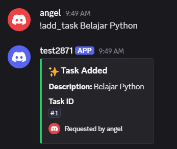
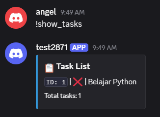
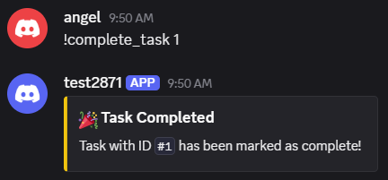
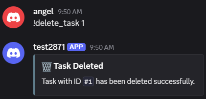

# 🤖 Discord Task Manager Bot

A modular, production-ready Discord bot for managing daily tasks built with **Python 3.11**, **`discord.py`**, **SQLAlchemy (Async ORM)**, and **`aiosqlite`**. 


---

## 📌 Command Usage

Below is the list of available commands and how to use them in your Discord server:

| Command | Description | Example |
|---|---|---|
| `!add_task <description>` | Add a new task with a description | `!add_task Belajar Python` |
| `!show_tasks` | Display all saved tasks and their completion status | `!show_tasks` |
| `!complete_task <task_id>` | Mark a specific task as completed by its ID | `!complete_task 1` |
| `!delete_task <task_id>` | Delete a specific task from the database by its ID | `!delete_task 1` |

> 💡 **Note:** All command responses are visually formatted using clean **Discord Embeds**.

---

## 🏗️ Tech Stack & Architecture

* **Language:** Python 3.11
* **Bot Framework:** `discord.py` (Cogs modular architecture)
* **Database & ORM:** SQLite, `SQLAlchemy` (Async), `aiosqlite`
* **Testing:** `pytest`, `pytest-asyncio`
* **Environment Management:** `python-dotenv`

### System Design
```text
[ Discord User ]
       │
       ▼
[ bot.py ]          --> Entry point & configuration loader
       │
       ▼
[ commands.py ]     --> Presentation Layer (Discord Cog & UI Embeds)
       │
       ▼
[ database.py ]     --> Data Layer (SQLAlchemy Models & CRUD logic)
       │
       ▼
[ SQLite DB ]

```

---

## 🛠️ Installation & Setup

### Prerequisites

* Python 3.11 or higher
* Git
* A Discord Bot Token (from [Discord Developer Portal](https://discord.com/developers/applications))

### 🔑 How to Get a Discord Bot Token

1. Go to the [Discord Developer Portal](https://discord.com/developers/applications).
2. Click **New Application** and enter a name for your bot.
3. Navigate to the **OAuth2** tab, select the `bot` scope, and check `Administrator` under **General Permissions**.
4. Copy the generated URL and open it in a new browser tab to invite the bot to your server.
5. Go to the **Bot** tab, scroll down to **Privileged Gateway Intents**, and enable **Message Content Intent**.
6. Under Bot Permissions in the same tab, set **General Permissions** to `Administrator`.
7. Click **Reset Token** (or **Copy**), then paste the token into your `.env` file as `DISCORD_TOKEN`.

### Step-by-Step Installation

1. **Clone the repository:**
```bash
git clone https://github.com/ajsn-gde/task_manager_bot.git
cd task_manager_bot
```


2. **Create and activate virtual environment:**
* **Windows (PowerShell/CMD):**
```cmd
python -m venv venv
venv\Scripts\activate
```


* **Linux / macOS:**
```bash
python3 -m venv venv
source venv/bin/activate
```


3. **Install dependencies:**
```bash
pip install -r requirements.txt
```


4. **Environment setup:**
Create a `.env` file in the root project directory and add your credentials:
```env
DISCORD_TOKEN=your_discord_bot_token_here
PREFIX=!
```


---

## 🏃 Startup & How to Run

1. Make sure your virtual environment is activated (`(venv)` shown in your terminal).
2. Start the Discord bot entry point:
```bash
python bot.py
```

3. Once successful, the terminal will show:
```text
🤖 bot logged in as: <YourBotName> (id: <BotID>)
--------------------------------------------------
```

---

## 🧪 Running Unit Tests (TDD)

All CRUD database operations are thoroughly tested with asynchronous unit tests covering both success and edge/error scenarios.

Run the test suite using `pytest`:

```bash
python -m pytest
```
---
## 📸 Bot Preview & Output
Here is how the bot interaction and Discord Embed responses look inside a Discord server:
### 1. Add Task (`!add_task`)


### 2. Show Tasks (`!show_tasks`)


### 3. Complete Task (`!complete_task`)


### 4. Delete Task (`!delete_task`)
